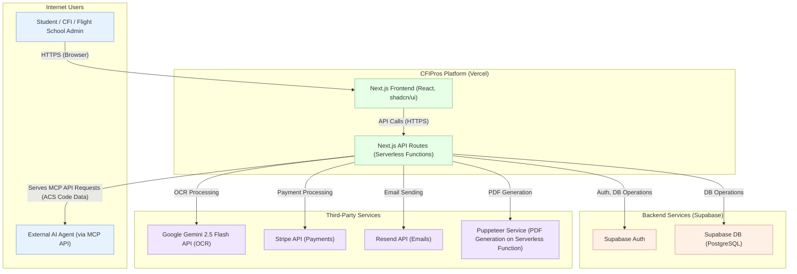

-----

# CFIPros Architecture Document

## 1\. Technical Summary

CFIPros is a modern web application built using a serverless architecture, leveraging Next.js for both the frontend and backend API routes, hosted on Vercel. It utilizes Supabase (PostgreSQL) as its Backend as a Service (BaaS) for database storage, user authentication, and row-level security. The core functionality revolves around the FAA Knowledge Test Extraction Tool, which uses the Google Gemini 2.5 Flash API for OCR processing of uploaded test documents (PDFs/images) and matches extracted data against an internal ACS codes database. Stripe is integrated for subscription management for CFIs and Flight Schools, and Resend is used for transactional email delivery. The system is designed to be modular, initially supporting key features for Students, CFIs, and Flight School Administrators, with a focus on providing actionable insights from test data and ensuring a "calm UX." An initial read-only Model Context Protocol (MCP) API (V1) will also be provided; for V1, this API will allow authenticated external AI agents to retrieve details (e.g., descriptions, areas, tasks) for specific FAA Airman Certification Standards (ACS) codes directly from the CFIPros ACS database, without involving any user data or PII. The primary goals are to streamline instructional processes and aid FAA compliance, starting with efficient test data management.

## 2\. High-Level Overview

CFIPros employs a **Serverless Web Application** architectural style. The frontend, built with Next.js and React (using shadcn/ui and Tailwind CSS), is served statically and dynamically by Vercel. Backend logic, including API endpoints for data manipulation, business rules, and integrations with third-party services, is implemented as Next.js API routes, which run as serverless functions on Vercel.

Supabase acts as the core BaaS provider, handling:

  * **Database:** PostgreSQL for storing user data, processed test results, ACS codes, subscription information, API keys, invitations, and report summaries.
  * **Authentication:** Managing user accounts (Students, CFIs, School Admins) and providing JWT-based session management.
  * **Authorization:** Row Level Security (RLS) policies in PostgreSQL will enforce data access rules based on user roles and relationships.

The primary user interaction flow involves users uploading FAA Knowledge Test documents. These are processed by a backend API route coordinating with the Gemini API. Extracted information is matched against ACS codes and stored in Supabase. Results are presented to the user with PDF report generation options (via Puppeteer). Subscribed CFIs/Schools access aggregated analytics and manage linked students.

The V1 Model Context Protocol (MCP) API allows authenticated external agents to query ACS code details from the CFIPros database (no user data).

### System Context Diagram

## 3\. Component View

The CFIPros application consists of major logical components primarily within the Next.js application on Vercel, with Supabase providing backend services.

```mermaid
graph TD
    subgraph "User Facing (Browser)"
        UI["Next.js Frontend (React Components with shadcn/ui & Tailwind CSS)"]
    end

    subgraph "Application Backend (Next.js API Routes on Vercel)"
        APIGateway["API Routes (pages/api/*)"]
        AuthHandler["Authentication Handler"]
        TestProcService["FAA Test Processing Service"]
        ReportGenService["PDF Report Generation Service (Puppeteer)"]
        UserMgmtService["User & Profile Management Service"]
        StudentMgmtService["Student & Link Management Service"]
        SubscriptionService["Subscription Management Service (Stripe)"]
        AnalyticsService["Organizational Analytics Service"]
        MCPApiService["MCP API Service (ACS Code Lookup)"]
        EmailService["Email Service (Resend)"]
        InvitationService["Invitation Management Service"]
        ReportSummaryService["Report Summary Management Service"]
    end

    subgraph "Core Services (Supabase)"
        SupabaseAuth["Supabase Authentication"]
        SupabaseDB["Supabase Database (PostgreSQL)"]
        ACSDb["(ACS Codes Table)"]
        UserProfilesDB["(User Profiles Table)"]
        KnowledgeTestsDB["(Knowledge Tests Table)"]
        ReportSummariesDB["(Report Summaries & Items Tables)"]
        McpApiKeysDB["(MCP API Keys Table)"]
        InvitationsDB["(Invitations Table)"]
        LinkTablesDB["(Link Tables)"]
        SubscriptionsDB["(Subscriptions Table)"]
    end

    subgraph "External Services"
        GeminiAPI["Google Gemini 2.5 Flash API"]
        StripeAPI["Stripe API"]
        ResendAPI["Resend API"]
    end

    UI --> APIGateway;
    APIGateway --> AuthHandler;
    APIGateway --> TestProcService;
    APIGateway --> ReportGenService;
    APIGateway --> UserMgmtService;
    APIGateway --> StudentMgmtService;
    APIGateway --> SubscriptionService;
    APIGateway --> AnalyticsService;
    APIGateway --> MCPApiService;
    APIGateway --> EmailService;
    APIGateway --> InvitationService;
    APIGateway --> ReportSummaryService;

    AuthHandler -- "Interacts with" --> SupabaseAuth;
    TestProcService -- "Uses" --> GeminiAPI;
    TestProcService -- "Accesses/Stores" --> SupabaseDB;
    ReportGenService -- "Accesses" --> SupabaseDB;
    UserMgmtService -- "Manages in" --> SupabaseDB;
    StudentMgmtService -- "Manages in" --> SupabaseDB;
    SubscriptionService -- "Uses" --> StripeAPI;
    SubscriptionService -- "Manages in" --> SupabaseDB;
    AnalyticsService -- "Aggregates from" --> SupabaseDB;
    MCPApiService -- "Accesses" --> SupabaseDB;
    EmailService -- "Sends via" --> ResendAPI;
    InvitationService -- "Manages in" --> SupabaseDB;
    ReportSummaryService -- "Manages in" --> SupabaseDB;

    SupabaseDB -.-> ACSDb;
    SupabaseDB -.-> UserProfilesDB;
    SupabaseDB -.-> KnowledgeTestsDB;
    SupabaseDB -.-> McpApiKeysDB;
    SupabaseDB -.-> InvitationsDB;
    SupabaseDB -.-> LinkTablesDB;
    SupabaseDB -.-> SubscriptionsDB;
    SupabaseDB -.-> ReportSummariesDB;

    classDef browser fill:#E6F3FF,stroke:#B0C4DE,stroke-width:2px;
    classDef appbackend fill:#E6FFE6,stroke:#B0D8B0,stroke-width:2px;
    classDef supabasecore fill:#FFF0E6,stroke:#E0C0B0,stroke-width:2px;
    classDef external fill:#F0E6FF,stroke:#C0B0E0,stroke-width:2px;
    class UI browser;
    class APIGateway,AuthHandler,TestProcService,ReportGenService,UserMgmtService,StudentMgmtService,SubscriptionService,AnalyticsService,MCPApiService,EmailService,InvitationService,ReportSummaryService appbackend;
    class SupabaseAuth,SupabaseDB,ACSDb,UserProfilesDB,KnowledgeTestsDB,McpApiKeysDB,InvitationsDB,LinkTablesDB,SubscriptionsDB,ReportSummariesDB supabasecore;
    class GeminiAPI,StripeAPI,ResendAPI external;
```

  * **UI (Next.js Frontend):** Renders user interface, handles user input, client-side state. (Details in `docs/ui-ux-spec.md`, `docs/project-structure.md`).
  * **Application Backend (Next.js API Routes/Services):**
      * **API Gateway (`pages/api/*` or `app/api/*`):** Entry point for client requests.
      * **Authentication Handler:** Manages auth flows via Supabase Auth.
      * **FAA Test Processing Service:** Handles OCR (Gemini), ACS matching, data storage.
      * **PDF Report Generation Service:** Uses Puppeteer for PDF creation.
      * **User & Profile Management Service:** Manages user profiles.
      * **Student & Link Management Service:** Manages student rosters and CFI/School/Student links.
      * **Subscription Management Service:** Integrates Stripe for subscriptions.
      * **Organizational Analytics Service:** Aggregates data for CFI/School analytics.
      * **MCP API Service:** Provides ACS code lookup for external agents.
      * **Email Service:** Integrates Resend for transactional emails.
      * **Invitation Management Service:** Manages token-based user invitations.
      * **Report Summary Management Service:** Manages user-defined bundles of test reports.
  * **Core Services (Supabase):** Database, Authentication, RLS. (Details in `docs/data-models.md`).
  * **External Services:** Gemini, Stripe, Resend. (Details in `docs/api-reference.md`).

## 4\. Key Architectural Decisions & Patterns

  * **Serverless First (Vercel & Supabase):** Reduces infrastructure management, enables auto-scaling, cost-effective for MVP.
  * **Monorepo for Frontend & Backend (Next.js):** Simplifies development workflow and code sharing.
  * **Supabase for Authentication & Authorization:** Utilizes Supabase Auth and PostgreSQL RLS for secure role-based access. Soft deletes are implemented for key data.
  * **Stateless API Routes:** Essential for serverless scalability; session state managed by JWTs (Supabase Auth).
  * **Asynchronous Processing Considerations:** MVP aims for synchronous OCR/PDF generation within serverless limits (10s target for OCR). Longer tasks post-MVP might use queues.
  * **Externalized ACS Codes:** Seeded into Supabase from TS files for efficient querying and MCP API access.
  * **No Original File Storage (MVP):** Only extracted text and generated PDFs are stored.
  * **Component-Based UI (shadcn/ui & Tailwind CSS):** Promotes "calm UX," efficiency, and consistency.
  * **Dedicated Invitation System:** A separate `invitations` table manages token-based invitations for robust linking.
  * **Puppeteer for PDF Generation:** Ensures high-fidelity report rendering.
  * **MCP API V1 - ACS Code Lookup:** Provides ACS code details to external agents (no user data).
  * **MCP API Key Authentication & Management:** Uses API keys in `X-MCP-API-Key` header, hashes stored in DB, manual issuance for MVP.
  * (Refer to `docs/coding-standards.md` for detailed coding patterns and error handling).

## 5\. Infrastructure and Deployment Overview

  * **Cloud Provider:** Vercel (for application hosting), Supabase (for BaaS).
  * **Core Services Used:** Next.js serverless functions, Supabase PostgreSQL, Supabase Auth.
  * **Infrastructure as Code (IaC):** Not explicitly defined for MVP beyond Vercel/Supabase console configurations. If needed later (e.g., complex Supabase setup), tools like Terraform or Pulumi could be adopted.
  * **Deployment Strategy:** CI/CD via Vercel, triggered by Git pushes. Automatic builds and deployments for preview/staging and production branches.
  * **Environments:**
      * Development (local, Vercel development deployment)
      * Staging (Vercel Preview Deployments per PR)
      * Production (Vercel Production Deployment)
  * (Configuration details in `docs/environment-vars.md`).

## 6\. Data Flow (Example: Test Upload & Processing)

1.  User uploads PDF/Image via **UI (Next.js Frontend)**.
2.  Frontend sends file to **API Gateway (`/api/knowledge-tests/upload`)**.
3.  **FAA Test Processing Service (Next.js API Route)** receives file:
    a.  Validates file.
    b.  Calls **Gemini API** for OCR.
    c.  Parses OCR output.
    d.  Queries **ACSDb (Supabase)** for matching ACS codes.
    e.  Stores extracted data and matched codes in **KnowledgeTestsDB (Supabase)**.
4.  Service returns processing status/results to UI.
5.  User views results; can request PDF from **ReportGenService**, which uses **Puppeteer**.

## 7\. Key Reference Documents

  * Product Requirements: `docs/prd.md`
  * Epic Definitions: `docs/epics/`
  * Technology Stack: `docs/tech-stack.md`
  * Project Structure: `docs/project-structure.md`
  * Coding Standards: `docs/coding-standards.md`
  * API Reference: `docs/api-reference.md`
  * Data Models & Schema: `docs/data-models.md`
  * Environment Variables: `docs/environment-vars.md`
  * Testing Strategy: `docs/testing-strategy.md`
  * UI/UX Specification: `docs/ui-ux-spec.md`

## Change Log

| Change        | Date       | Version | Description                  | Author         |
| :------------ | :--------- | :------ | :--------------------------- | :------------- |
| Initial draft sections | 2025-05-09 | 0.1     | Technical Summary, High-Level Overview, initial Component View & Key Decisions | Architect Gem  |
| MCP API Clarification | 2025-05-09 | 0.2     | Updated MCP API scope in summary and overview | Architect Gem  |
| Gemini Version Update | 2025-05-09 | 0.3     | Corrected Gemini API version to 2.5 Flash | Architect Gem  |
| Component View & Decisions Finalized | 2025-05-09 | 0.4     | Expanded Component View and Key Architectural Decisions | Architect Gem  |
| MCP API Key Management | 2025-05-09 | 0.5     | Added MCP API key management details | Architect Gem  |
| Final Compilation | 2025-05-09 | 1.0     | Compiled final architecture document with all sections and references. | Architect Gem  |

---

--
